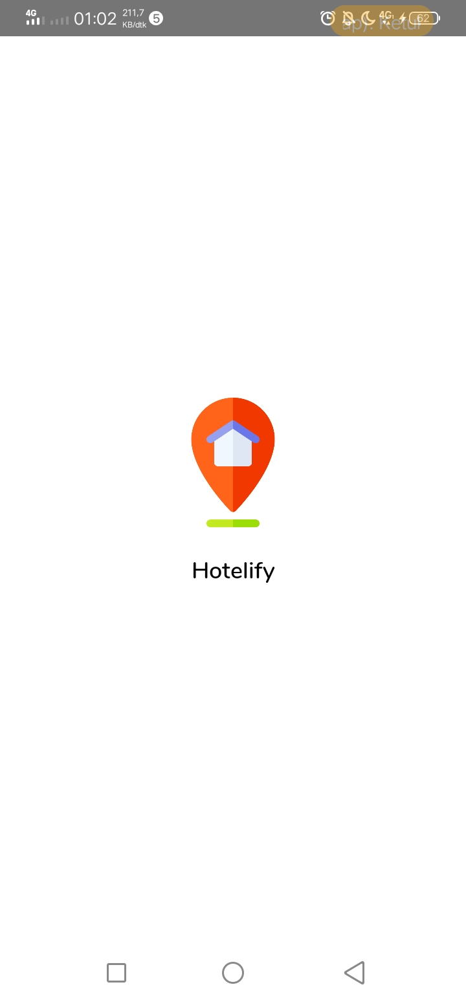
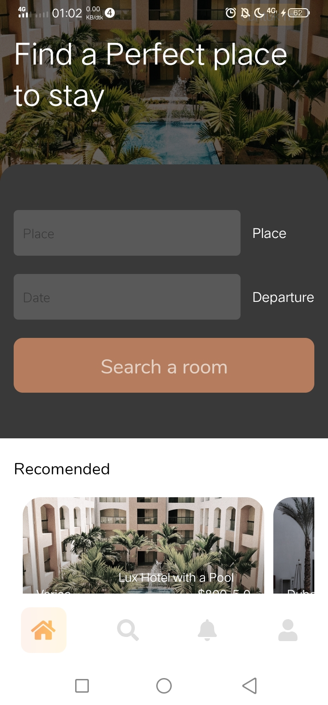

# Hotelify App

Hotelify App adalah sebuah aplikasi pemesanan hotel

# Persyaratan

- [NodeJS](https://nodejs.org/en/)
- [NPM](npmjs.com/)
- [Android SDK](https://developer.android.com/)
- [Java Depelovment Kit (JDK)](https://www.oracle.com/java/technologies/javase-jdk13-downloads.html)

# Instalasi

Clone atau download repositori ini

```
git clone https://github.com/Anggasayogo/Hotelify-app.git
```

install terlebih dahulu menggunakan perintah

```
npm install
```

lalu untuk mencobanya kamu bisa menjalankan

```
npx react-native run-android
```

Lalu akan muncul seperti ini

|                                          |                                          |     |     |
| ---------------------------------------- | ---------------------------------------- | --- | --- |
|  |  |     |     |
|                                          |                                          |     |     |
|                                          |                                          |     |     |
